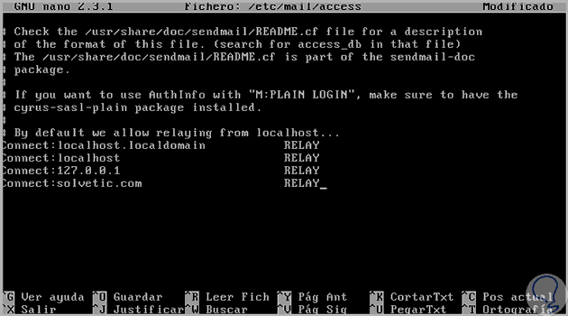

# Instalar y configurar servidor de correo en CentOS 7 (sendmail)

1. Instalar repositorios EPEL
----------------------------------------------

En primer lugar, debemos instalar los repositorios de EPEL para posteriormente instalar el MTA a usar para el servicio de correo, recordemos que EPEL son los paquetes adicionales para Enterprise Linux que nos brinda complementos para los paquetes de software en las ediciones CentOS, RHEL y Fedora.

Para instalar dichos repositorios usaremos el comando:

    sudo yum -y install  epel-release

> Recordemos que si se ejecutan estos comandos con un usuario diferente al root debemos anteponer el término sudo

2. Instalar Apache para gestión de servidor de correo
----------------------------------------------

El siguiente paso consiste en instalar Apache usando el parámetro –-disablerepo=epel* el cual nos permite realizar la instalación directamente de los repositorios oficiales. Usaremos el siguiente comando.

    sudo yum -y install  --disablerepo=epel*

3. Instalación de aplicaciones necesarias
----------------------------------------------

Una vez realizado el proceso anterior instalaremos las siguientes aplicaciones:
- Sendmail (El cual será usado para el envío de los correos)
- Dovecot
- Squirrelmail (Será nuestro cliente web de correos)

**`Paso 1`**

Para ello usaremos el siguiente comando

    sudo yum -y install sendmail sendmail-cf dovecot squirrelmail

**`Paso 2`**

Ahora validaremos el servicio Postfix. Este servicio por defecto viene instalado en CentOS 7, procedemos a buscarlo y en caso de encontrarlo procedemos a detenerlo, para ello usaremos los siguientes comandos.

    rpm -qa | grep postfix

    systemctl stop postfix

**`Paso 3`**

A continuación, modificaremos el nombre del equipo por un nombre de dominio válido, en este caso usaremos el nombre solvetic.com e ingresaremos lo siguiente en CentOS 7:

    sudo hostname solvetic.com

4. Configuración de Dovecot
--------

**`Paso 1`**

Para configurar los parámetros de Dovecot debemos ingresar en la siguiente ruta /etc/dovecot/dovecot.conf, podemos usar el editor preferido, en este caso usaremos nano.

    sudo nano /etc/dovecot/dovecot.conf

Veremos que se despliega lo siguiente.

IMAGEN AQUI

**`Paso 2`**

En esta configuración debemos ubicar la línea siguiente

    Protocols we want to be serving

IMAGEN AQUI

**`Paso 3`**

Allí descomentamos la línea Protocols = imap pop3 lmtp (Quitando el símbolo #) y dejamos los protocolos que usaremos, en este caso IMAP y pop3.

IMAGEN AQUI

**`Paso 4`**

Guardamos y salimos del editor

    Ctrl + o
    Ctrl + x

**`Paso 5`**

Ahora ingresaremos en la ruta /etc/dovecot/conf.d/10-mail.conf para su edición, ingresamos:

    sudo nano /etc/dovecot/conf.d/10-mail.conf

IMAGEN AQUI

**`Paso 6`**

Allí debemos copiar la línea mail_location = mbox: ~/mail:INBOX=/var/mail/%u y pegarla en el campo mail_location debajo de la línea <doc/wiki/MailLocation.txt> y teniendo en cuenta quitar el símbolo #.

IMAGEN AQUI

**`Paso 7`**

Finalmente accedemos al archivo ubicado en la ruta /etc/dovecot/conf.d/10-auth.conf, ingresaremos:

    sudo nano /etc/dovecot/conf.d/10-auth.conf

IMAGEN AQUI

**`Paso 8`**

Allí simplemente debemos descomentar (quitar símbolo #) de la línea

    disable_plaintext_auth = yes

IMAGEN AQUI

**`Paso 9`**

Guardamos y salimos del editor

    Ctrl + o
    Ctrl + x

5. Configuración de Sendmail
----

**`Paso 1`**

Ahora debemos acceder a la siguiente ruta /etc/mail/sendmail.mc para efectuar los cambios en la configuración de Sendmail, usaremos nano para acceder a la edición.

    sudo nano /etc/mail/sendmail.mc

IMAGEN AQUI

**`Paso 2`**

Allí ubicaremos la línea

    DAEMON_OPTIONS (“port=smtp,Addr=127.0.0.1, Name=MTA”)dn1

**`Paso 3`**

En esta línea removemos el apartado asociado a Addr quedando de esta manera la línea.

**`Paso 4`**

Guardamos los cambios. Una vez ejecutado este cambio usaremos el comando m4 para modificar el formato de Sendmail de .mc a .cf (Es una compilación), para ello usaremos el siguiente comando.

    sudo m4 /etc/mail/sendmail.mc > /etc/mail/sendmail.cf

6. Configuración de Squirrelmail
----

**`Paso 1`**

El siguiente paso consiste en acceder a la ruta /etc/mail/local-host-names usando nano para realizar algunos ajustes, ingresaremos.

    sudo nano  /etc/mail/local-host-names

IMAGEN AQUI

**`Paso 2`**

Allí ingresaremos el nombre del dominio, en este caso solvetic.com.

IMAGEN AQUI

**`Paso 3`**

Guardamos los cambios.A continuación accederemos usando nano a la siguiente ruta:

    nano /etc/mail/Access

IMAGEN AQUI

**`Paso 4`**

Allí debemos añadir una línea con el nombre de nuestro dominio. Guardamos los cambios usando

**`Paso 5`**

Una vez efectuados estos cambios procedemos a reiniciar los servicios usando los siguientes comandos:

    systemctl start httpd
    systemctl start sendmail.service
    systemctl start dovecot.service

IMAGEN AQUI

7. Acceder a la consola web
-----

Para este análisis hemos creado dos usuarios usando el comando useradd llamados correosolvetic y solvetic1.

**`Paso 1`**

A continuación, debemos ir a un navegador e ingresar la siguiente sintaxis:

    http://Dirección_IP/webmail

En nuestro caso ingresamos

    http://192.168.0.11/webmail

IMAGEN AQUI

**`Paso 2`**

Ingresamos nuestras credenciales y veremos el siguiente error.

IMAGEN AQUI

**`Paso 3`**

Este error de debe a que la carpeta que contendrá la información del servidor de correo no existe. Para solucionar esto debemos usar el siguiente comando para crear la respectiva carpeta en la raíz del usuario seleccionado, en este caso correosolvetic (y aplicarlo a cada uno de los usuarios creados)

    touch /home/correosolvetic/mail/.imap/INBOX

**`Paso 4`**

Posteriormente debemos modificar el propietario de la carpeta usando los siguientes comandos:

    sudo chown -R correosolvetic:correosolvetic /var/www/html/correosolvetic

**`Paso 5`**

Ahora de nuevo intentamos acceder y veremos lo siguiente.

IMAGEN AQUI

**`Paso 6`**

Vemos que ya tenemos dos mensajes en nuestra bandeja de entrada, estos fueron enviados desde la consola usando la siguiente sintaxis:

- mail usuario
- Subject (Motivo)
- Cuerpo del mensaje

IMAGEN AQUI

**`Paso 7`**

Para enviar el mensaje desde la terminal usamos la combinación.

    cTRL + D

8. Visualizar y enviar mensajes desde el cliente
--------

**`Paso 1`**

Para ver los mensajes almacenados en nuestro buzón basta con seleccionarlo y obtendremos el motivo del correo

**`Paso 2`**

Para enviar un mensaje a otro correo, por ejemplo, hemos iniciado sesión con el usuario solvetic1 y enviaremos un mensaje al usuario correosolvetic, debemos seleccionar la opción Compose ubicada en la parte superior y especificar el destinatario, motivo y mensaje.

**`Paso 3`**

Pulsamos Send y el usuario correosolvetic recibirá el mensaje enviado.

Usando este método podemos configurar un servidor de correo en nuestros sistemas Linux, en este caso CentOS 7 para permitir la intercomunicación entre los diversos usuarios de la organización de forma sencilla y práctica.

Fuentes:
[Solvetic](https://www.solvetic.com/tutoriales/article/3264-instalar-y-configurar-servidor-correo-centos/)