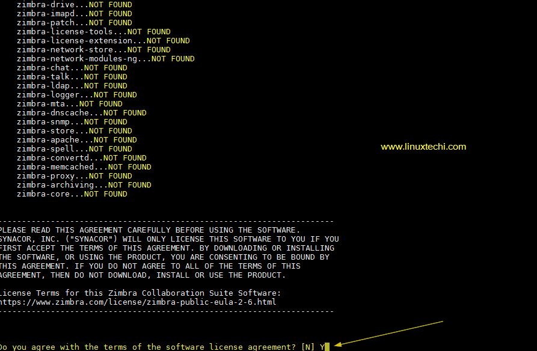
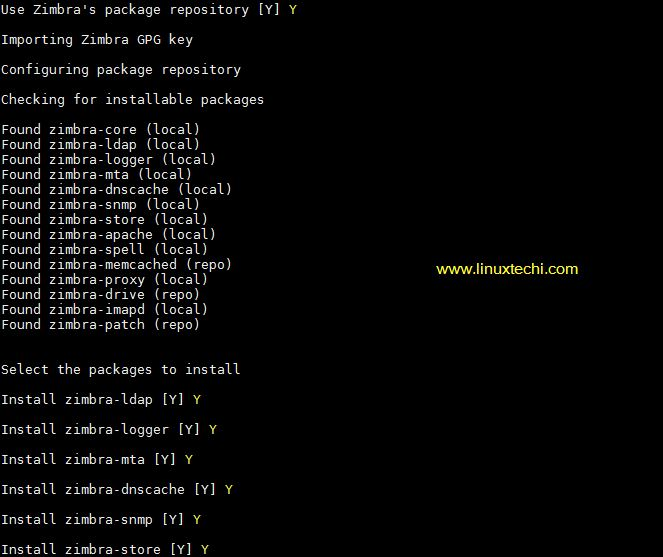
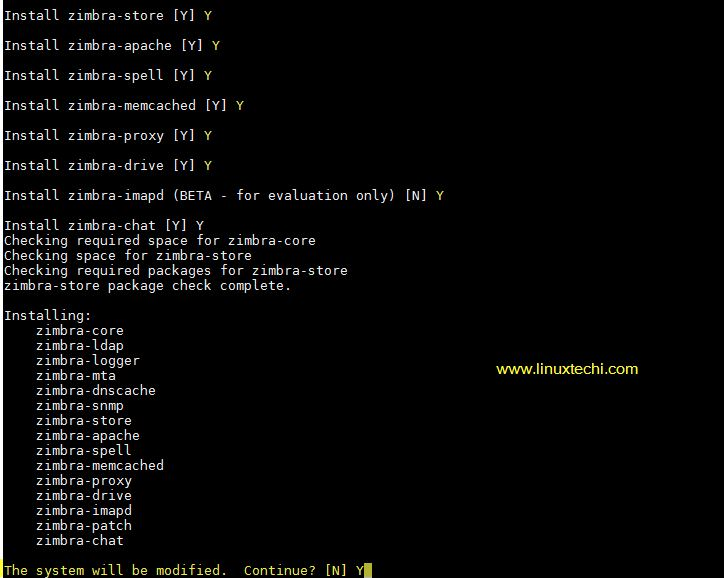
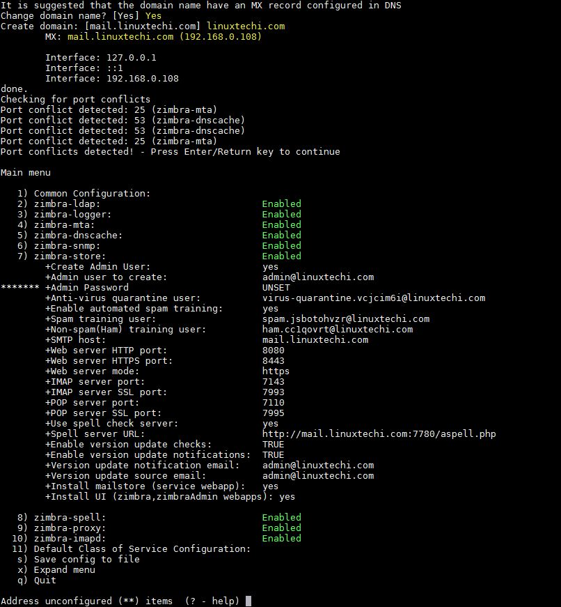
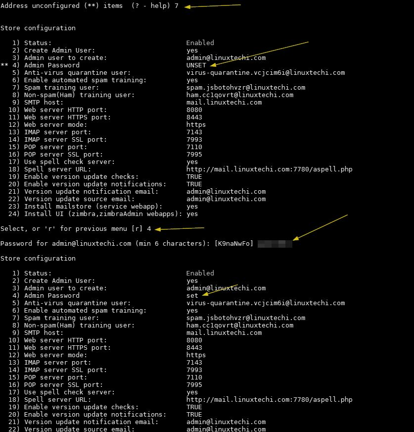
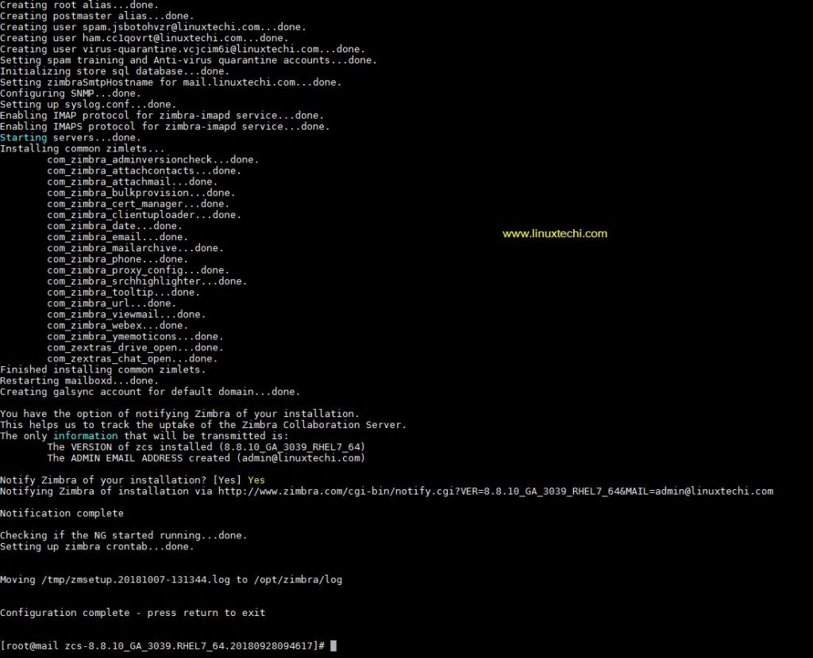
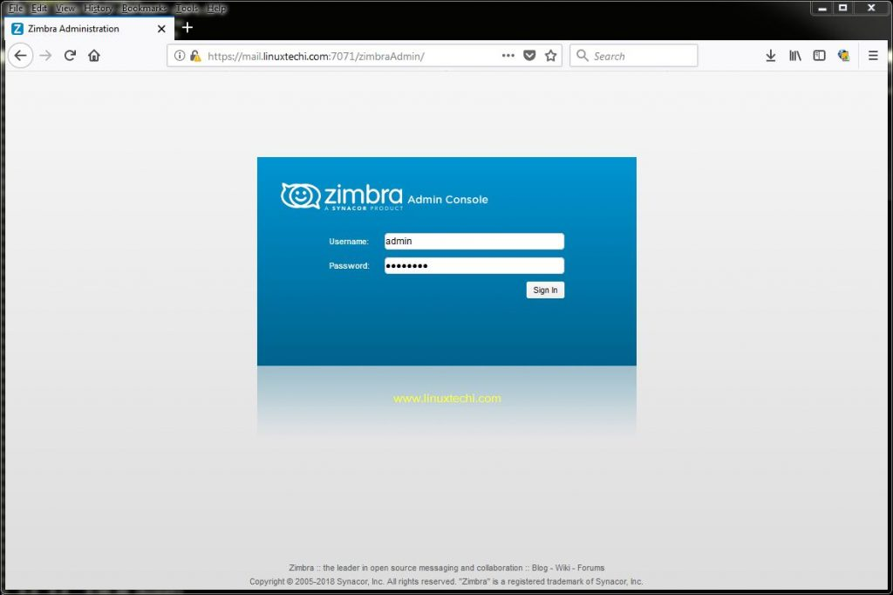
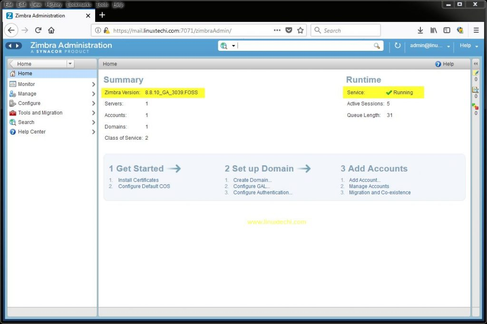
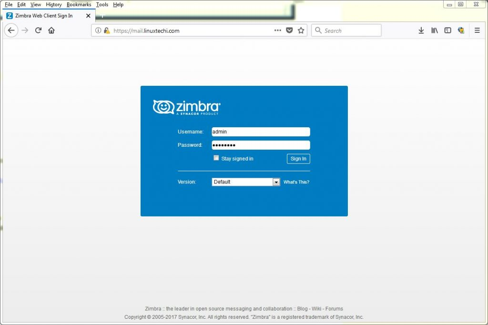
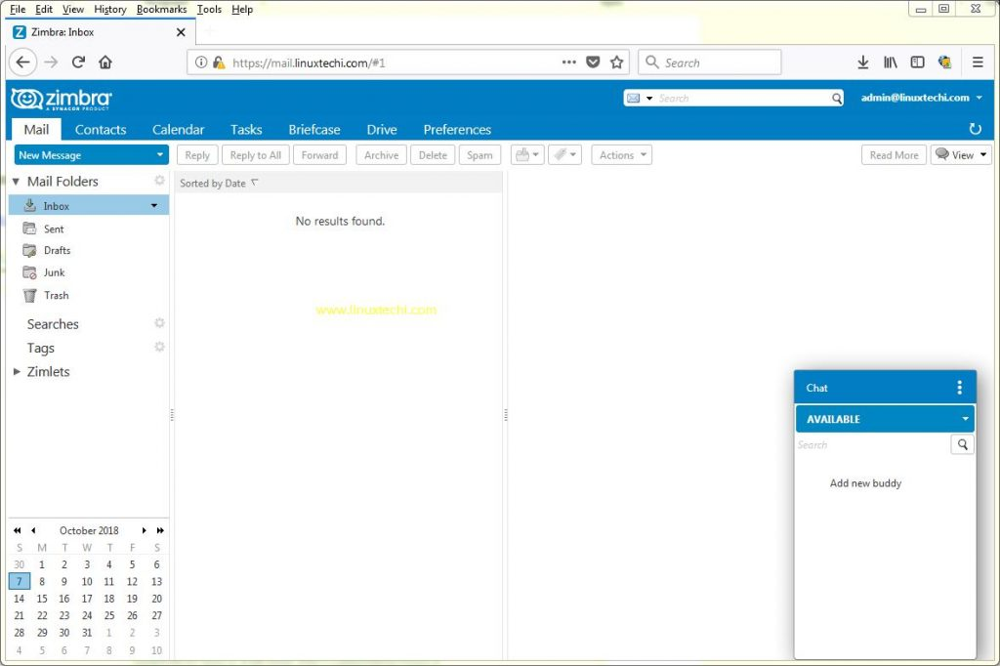

# Instalar y configurar servidor de correo en CentOS 7 (zimbra)

1. Instalar dependencias de Zimbra usando yum
-----

Ejecute el siguiente comando para instalar dependencias Zimbra / ZCS

    yum instalar unzip net-tools sysstat openssh-clients perl-core libaio nmap-ncat libst

2. Descargar la última versión de Zimbra (ZCS 8.8.10) usando el comando wget
-----

**`Paso 1`**

Crear una carpeta con el nombre «zimbra»

    mkdir zimbra && cd zimbra

**`Paso 2`**

Utilice el siguiente comando wget para descargar la última versión de ZCS 8.8.10 desde el terminal

    wget http://files.zimbra.com/downloads/8.8.10_GA/zcs-8.8.10_GA_3039.RHEL7_64.20180928094617.tgz --no-check-certificate

3. Instalar Zimbra / ZCS 8.8.10
------

**`Paso 1`**

Extraiga el archivo tgz descargado de ZCS 8.8.10 usando el comando debajo de tar

    tar zxpvf zcs-8.8.10_GA_3039.RHEL7_64.201809280928094617.tgz

**`Paso 2`**

Vaya a la carpeta extraída y ejecute el script de instalación

    cd zcs-8.8.10_GA_3039.RHEL7_64.20180928094617

    ./install.sh

**`Paso 3`**

Una vez que ejecutemos el script de instalación, obtenemos un asistente de instalación basado en texto, para Aceptar la licencia, pulse Y

**`Paso 4`**

Ahora configure el repositorio de paquetes de Zimbra y seleccione todos los componentes de Zimbra que desee instalar.

Presione Y para modificar el Sistema

Después de presionar Y, descargará los paquetes relacionados con Zimbra y puede tomar tiempo dependiendo de tu velocidad de Internet.

**`Paso 5`**

Una vez que todos los paquetes de Zimbra estén instalados en el backend entonces obtendremos la siguiente ventana

Ahora Presione 7 y luego 4 para establecer la contraseña de usuario del administrador

Ahora pulse » r » para ir al menú anterior y luego pulse » a » para aplicar los cambios.

**`Paso 6`**

Una vez que se apliquen todos los cambios y se inicien los servicios relacionados con Zimbra, obtendremos el resultado de la siguiente manera

**`Paso 7`**

Abra los puertos en el firewall en caso de que el firewall se esté ejecutando en su servidor

    firewall-cmd –permanente –add-port={25,80,110,143,443,465,587,993,995,5222,5223,9071,7071}/tcp

    firewall-cmd –reload

4. Acceder a Zimbra Admin Portal & Web Mail Client
-----

Para acceder al Zimbra Admin Portal, escriba la siguiente URL en el explorador web

    http://mail.linuxtechi.com:7071/

--------

Para acceder a Zimbra Mail Web Client, escriba la siguiente URL en el navegador

    http://mail.linuxtechi.com

--------

>Nota: Para ambas URLs podemos usar el nombre de usuario como «admin» y la contraseña que establezcamos durante la instalación

5. Solución de problemas de los servicios y registros de Zimbra
--------

Puede haber algunos escenarios en los que algunos servicios de zimbra puedan ser detenidos, para encontrar el estado de los servicios de zimbra desde la línea de comandos, ejecute el siguiente comando

    su - zimbra
        Último inicio de sesión: Domingo 7 de octubre 14:59:48 IST 2018 en pts/0
    zmcontrol status
        Anfitrión mail.linuxtechi.com
        amavis corriendo
        antispam Ejecución
        antivirus En ejecución
        Ejecución de dnscache
        imapd En marcha
        ldap Correr
        logger En marcha
        Ejecución de buzón de correo
        memcached Correr
        mta Correr
        opendkim Correr
        Ejecución de proxy
        servicio webapp Ejecutando
        snmp Correr
        hechizo Correr
        Estadísticas en ejecución
        zimbra webapp Ejecutando
        zimbraAdmin webapp Ejecutando
        zimlet webapp Ejecutando
        zmconfigd Ejecutando
    
Para reiniciar los Servicios Zimbra utilice el siguiente comando

    zmcontrol reiniciar

Todos los archivos de registro del servidor Zimbra se guardan en la carpeta «/opt/zimbra/log»

> Nota: En mi caso postfix ya estaba instalado y corriendo en mi servidor centos 7 debido a que el servicio de Zimbra MTA estaba siendo detenido y fallaba. Para resolver este problema, tengo que parar y desactivar el servicio postfix y luego reiniciar el servicio Zimbra usando el comando » zmcontrol

Cuando hayas terminado con las pruebas de Zimbra y quieras desinstalarlo del sistema, ejecuta el script » install.sh » seguido de » -u »

    cd /root/zimbra/zcs-8.8.10_GA_3039.RHEL7_64.20180928094617
    
    ./install.sh -u

Fuentes:
[Aldealinux](https://aldealinux.com/como-instalar-el-servidor-de-correo-zimbra-de-codigo-abierto-zcs-8-8-10-en-centos-7/)